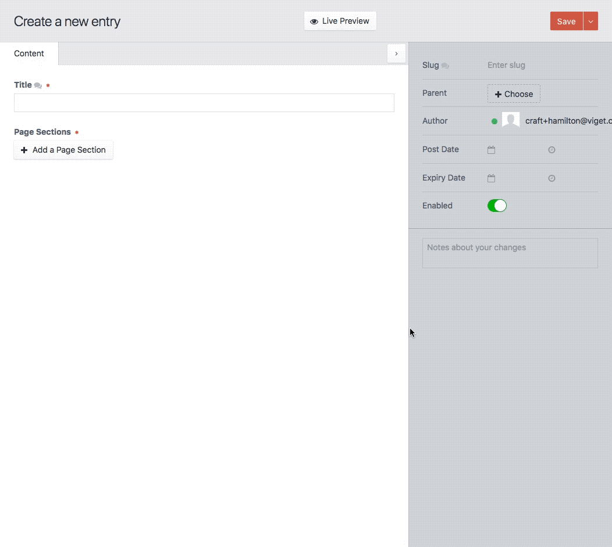

# Sidebar Toggle plugin for Craft CMS

Add ability to toggle the sidebar on element edit screens

## Installation

To install Sidebar Toggle, follow these steps:

1. Download & unzip the file and place the `sidebartoggle` directory into your `craft/plugins` directory
1. Install plugin in the Craft Control Panel under Settings > Plugins
1. The plugin folder should be named `sidebartoggle` for Craft to see it.  GitHub recently started appending `-master` (the branch name) to the name of the folder for zip file downloads.

Sidebar Toggle works on Craft 2.4.x and Craft 2.5.x.