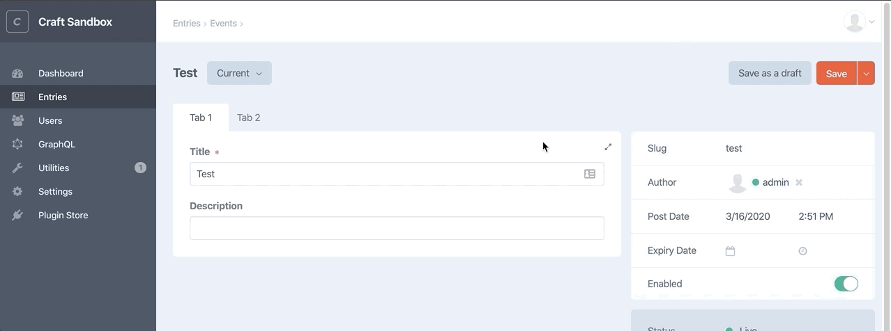

# Sidebar Toggle plugin for Craft CMS

Add ability to toggle the sidebar on element edit screens

## Requirements

This plugin requires Craft CMS 3.4.0 or later.

## Installation

To install the plugin, follow these instructions.

1. Open your terminal and go to your Craft project:

        cd /path/to/project

2. Then tell Composer to load the plugin:

        composer require viget/craft-sidebar-toggle

3. In the Control Panel, go to Settings → Plugins and click the “Install” button for Sidebar Toggle.